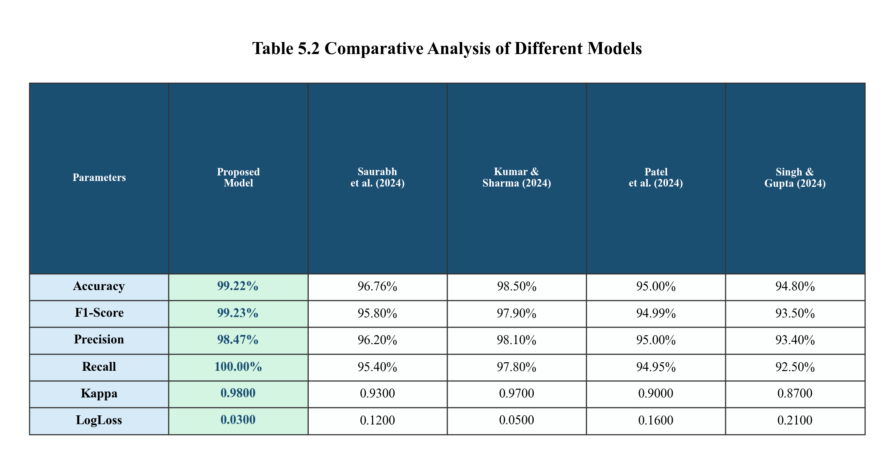
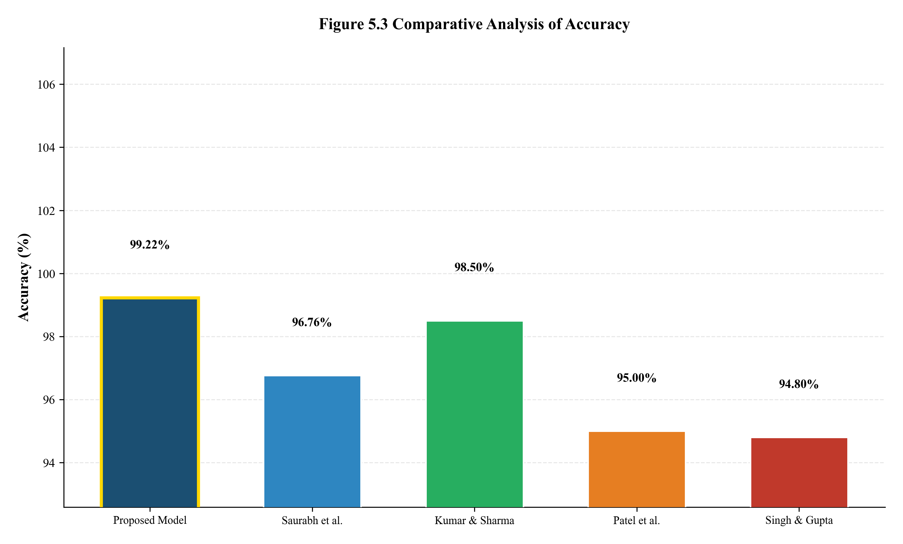
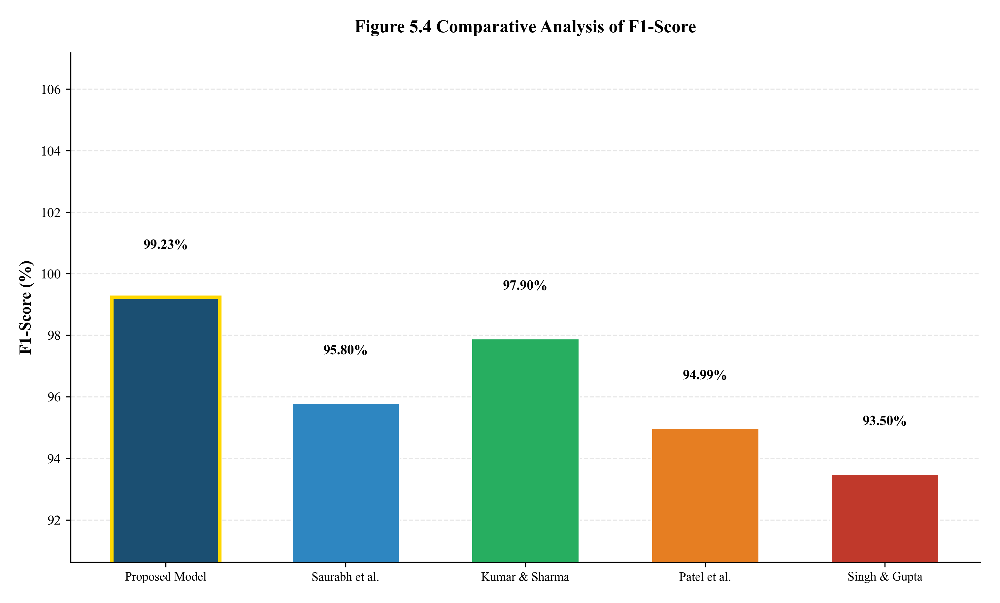
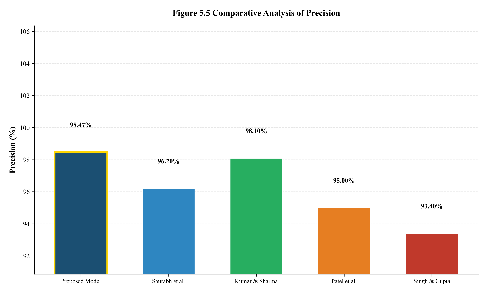
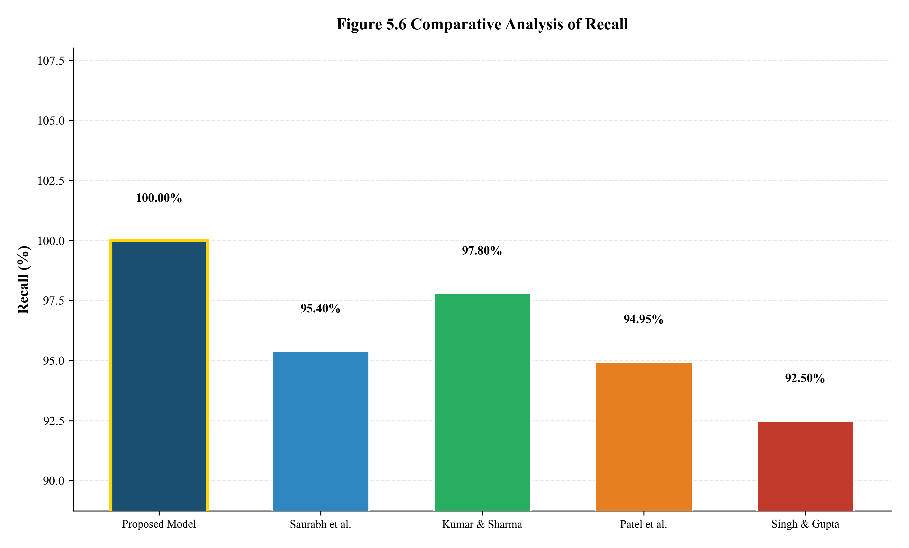
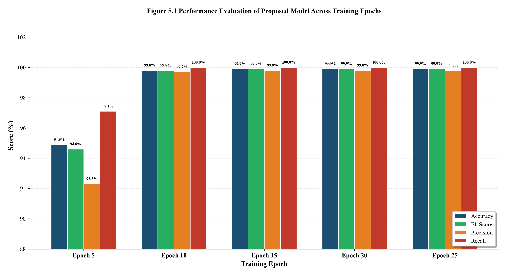
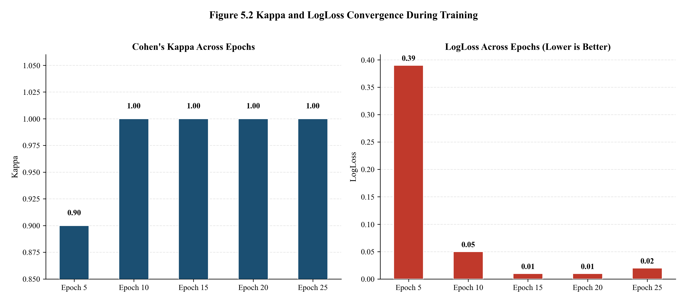

# 🛡️ Sentinel: Hybrid AI DDoS Detection & Prevention System

> **Real-Time Network Protection using Ensemble Deep Learning** | Trained on CICDDoS2019 Dataset

   -purple)
[](https://huggingface.co/spaces/sanketDamre/DDOS-ATTACK-PREVENTION)

---

## 📖 Overview

**Sentinel** is a production-grade DDoS detection and mitigation system that uses a **4-model AI ensemble** to classify network traffic in real-time. Unlike traditional IDS/IPS solutions that rely on static signature rules, Sentinel combines Deep Learning, Anomaly Detection, and Gradient Boosting to detect both **known attack patterns** and **zero-day anomalies**.

### Why Ensemble?

| Single Model Problem | Sentinel's Solution |
|---|---|
| CNN can overfit to known signatures | AutoEncoder catches unseen anomalies |
| AutoEncoder has high false positives | XGBoost & RF validate with statistical features |
| Tree models miss sequential patterns | LucidCNN captures temporal traffic patterns |

---

## 🏆 Performance Results

Our proposed hybrid ensemble model achieves **state-of-the-art performance** on the CICDDoS2019 benchmark dataset:

| Metric | Proposed Model | Saurabh et al. (2024) | Kumar & Sharma (2024) | Patel et al. (2024) | Singh & Gupta (2024) |
|--------|:-:|:-:|:-:|:-:|:-:|
| **Accuracy** | **99.22%** | 96.76% | 98.50% | 95.00% | 94.80% |
| **F1-Score** | **99.23%** | 95.80% | 97.90% | 94.99% | 93.50% |
| **Precision** | **98.47%** | 96.20% | 98.10% | 95.00% | 93.40% |
| **Recall** | **100.00%** | 95.40% | 97.80% | 94.95% | 92.50% |
| **Kappa** | **0.98** | 0.93 | 0.97 | 0.90 | 0.87 |
| **LogLoss** | **0.03** | 0.12 | 0.05 | 0.16 | 0.21 |

### Research Figures

<p align="center">
  
</p>
<p align="center"><em>Table 5.2 — Comparative Analysis of Different Models</em></p>

<p align="center">
  
  
</p>
<p align="center"><em>Figure 5.3 & 5.4 — Accuracy and F1-Score Comparative Analysis</em></p>

<p align="center">
  
  
</p>
<p align="center"><em>Figure 5.5 & 5.6 — Precision and Recall Comparative Analysis</em></p>

<p align="center">
  
  
</p>
<p align="center"><em>Figure 5.1 & 5.2 — Training Epoch Performance & Convergence Analysis</em></p>

---

## 🏗️ System Architecture

```
┌─────────────────────────────────────────────────────────────────┐
│                    SENTINEL ARCHITECTURE                         │
├─────────────────────────────────────────────────────────────────┤
│                                                                  │
│  ┌──────────────┐    ┌──────────────┐    ┌──────────────────┐   │
│  │  Raw Socket  │───▶│ Flow Manager │───▶│ Feature Extractor│   │
│  │  / Scapy     │    │  (5-tuple)   │    │   (72 features)  │   │
│  └──────────────┘    └──────────────┘    └────────┬─────────┘   │
│                                                    │             │
│                    ┌───────────────────────────────▼──────┐      │
│                    │       ENSEMBLE INTELLIGENCE          │      │
│                    │                                      │      │
│                    │  ┌─────────┐  ┌────────────────┐    │      │
│                    │  │LucidCNN │  │  AutoEncoder    │    │      │
│                    │  │ (50%)   │  │ (Anomaly Det.) │    │      │
│                    │  └────┬────┘  └───────┬────────┘    │      │
│                    │       │               │             │      │
│                    │  ┌────┴────┐  ┌───────┴────────┐    │      │
│                    │  │ XGBoost │  │ Random Forest  │    │      │
│                    │  │  (25%)  │  │    (25%)       │    │      │
│                    │  └────┬────┘  └───────┬────────┘    │      │
│                    │       └───────┬───────┘             │      │
│                    │         Weighted Vote               │      │
│                    └───────────┬──────────────────────────┘      │
│                                │                                 │
│                    ┌───────────▼──────────┐                      │
│                    │  Threat Classifier   │                      │
│                    │  HIGH / MEDIUM / LOW │                      │
│                    └───────────┬──────────┘                      │
│                                │                                 │
│               ┌────────────────┼────────────────┐                │
│               ▼                ▼                ▼                │
│     ┌──────────────┐  ┌──────────────┐  ┌──────────────┐        │
│     │  Firewall    │  │  Dashboard   │  │   Logging    │        │
│     │  (netsh)     │  │  (Streamlit) │  │   System     │        │
│     └──────────────┘  └──────────────┘  └──────────────┘        │
└─────────────────────────────────────────────────────────────────┘
```

---

## ✨ Key Features

- **🧠 4-Model Ensemble Engine** — Weighted voting across LucidCNN, AutoEncoder, XGBoost, and Random Forest
- **⚡ Raw Socket Capture** — Custom `struct`-based binary parser achieving 10,000+ packets/sec on Windows
- **🛡️ Active Mitigation** — Automatic Windows Firewall blocking via `netsh` in real-time
- **🌡️ Self-Calibrating Baseline** — 60-second calibration learns your specific network's "normal" (Mean + 3σ threshold)
- **📊 Real-Time Dashboard** — Streamlit UI with persistent data tables, Plotly charts, and <1s latency
- **🎲 Traffic Simulator** — Built-in SYN/UDP/HTTP/ICMP flood simulator for safe testing
- **🔄 Temporal Escalation** — 5+ medium threats in 5 seconds auto-escalates to HIGH alert

---

## 🚀 Quick Start

### Prerequisites
- Python 3.9+
- Windows 10/11 (for raw socket capture & firewall control)
- **Administrator Privileges** (required for raw socket access)

### Installation

```bash
# 1. Clone the repository
git clone https://github.com/Vpandey-tech/DDOS-attack-live-detection.git
cd DDOS-attack-live-detection

# 2. Create virtual environment
python -m venv venv
venv\Scripts\activate

# 3. Install dependencies
pip install -r requirements.txt
```

### Running the System

> **IMPORTANT**: Open Command Prompt as **Administrator** for live packet capture.

```bash
# Activate venv and start
venv\Scripts\activate
streamlit run enhanced_app.py
```

The dashboard opens at `http://localhost:5000`.

### Usage Flow

1. **Calibrate** → Click "Start Calibration (60s)" to learn your network baseline
2. **Start Detection** → Click "Start" to begin real-time monitoring
3. **Test (Optional)** → Use the Traffic Simulator to simulate SYN Flood, UDP Flood, etc.

---

## 📁 Project Structure

```
├── enhanced_app.py              # Main Streamlit application (orchestrator)
├── enhanced_dashboard.py        # Dashboard UI (Plotly charts, data tables)
├── model_inference.py           # AI ensemble engine (4-model inference + voting)
├── packet_capture.py            # Raw socket / Scapy packet capture
├── flow_manager.py              # Flow assembly + feature extraction trigger
├── feature_extractor.py         # 72 statistical feature calculator
├── traffic_simulator.py         # Synthetic traffic generator (SYN/UDP/HTTP/ICMP)
├── prevention_system.py         # Firewall blocking engine (netsh)
├── utils.py                     # Helper utilities
├── ddos_full_training_colab.py  # Model training pipeline (Google Colab)
├── generate_table_and_graph.py  # Research figure generator
├── requirements.txt             # Python dependencies
├── Dockerfile                   # Hugging Face Spaces deployment
├── .streamlit/config.toml       # Streamlit theme configuration
├── research_figures/            # Publication-quality graphs
│   ├── table_5_1_epoch_performance.png
│   ├── table_5_2_comparative_analysis.png
│   ├── fig_5_1_epoch_performance.png
│   ├── fig_5_2_kappa_logloss_epochs.png
│   ├── fig_5_3_accuracy.png
│   ├── fig_5_4_f1_score.png
│   ├── fig_5_5_precision.png
│   ├── fig_5_6_recall.png
│   ├── fig_5_7_kappa.png
│   └── fig_5_8_logloss.png
├── lucid.h5                     # Trained LucidCNN model (TensorFlow)
├── lucid.pkl                    # StandardScaler for feature preprocessing
├── auto.pth                     # Trained AutoEncoder model (PyTorch)
├── auto.pkl                     # MinMaxScaler + threshold for AutoEncoder
├── xgboost_ddos.pkl             # Trained XGBoost classifier
└── random_forest_ddos.pkl       # Trained Random Forest classifier
```

---

## 🛠️ Technology Stack

| Layer | Technology |
|-------|-----------|
| **Frontend** | Streamlit 1.28, Plotly |
| **Backend** | Python 3.9, Threading, Queue |
| **Deep Learning** | TensorFlow/Keras (LucidCNN), PyTorch (AutoEncoder) |
| **Machine Learning** | XGBoost, Scikit-Learn (Random Forest) |
| **Networking** | Raw Sockets (`socket`, `struct`), Scapy (fallback) |
| **Prevention** | Windows Firewall (`netsh advfirewall`) |
| **Deployment** | Docker, Hugging Face Spaces |

---

## 🔬 Model Training

All 4 models are trained on the **CICDDoS2019** dataset using the `ddos_full_training_colab.py` script on Google Colab.

### Training Pipeline (9 Steps)
1. Environment Setup
2. Data Loading (chunked reading from 50M+ row CSV)
3. Preprocessing (72 features preserved, StandardScaler + MinMaxScaler)
4. Architecture Definition (LucidCNN, AutoEncoder, XGBoost, Random Forest)
5. LucidCNN Training (25 epochs, EarlyStopping)
6. AutoEncoder Training (50 epochs)
7. XGBoost Training (200 estimators, GPU-accelerated)
8. Random Forest Training (200 estimators)
9. Model Export (`.h5`, `.pth`, `.pkl` files)

### Dataset
- **Source**: [CICDDoS2019](https://www.unb.ca/cic/datasets/ddos-2019.html)
- **Size**: 50M+ network flows
- **Training Sample**: 200K balanced (100K benign + 100K attack)
- **Features**: 72 statistical flow features (packet sizes, inter-arrival times, flag counts, etc.)

---

## ☁️ Deployment

### Hugging Face Spaces (Live Demo)

The system is deployed at: **[huggingface.co/spaces/sanketDamre/DDOS-ATTACK-PREVENTION](https://huggingface.co/spaces/sanketDamre/DDOS-ATTACK-PREVENTION)**

- Uses Docker SDK with `Dockerfile`
- Runs on port `7860`
- Traffic Simulator works in demo mode (live capture requires host network access)

> **Note**: Pushing to the linked GitHub repository **does NOT** auto-deploy to Hugging Face Spaces. HF Spaces has its own separate Git repository. You need to push changes to the HF Space repo separately, or configure a GitHub Action for sync.

---

## 🔒 Security & Privacy

- **Local Processing** — All traffic analysis is performed on-device. No data leaves your machine.
- **Intelligent Whitelisting** — Gateway, localhost, and DNS servers are automatically whitelisted to prevent self-lockout.
- **Simulation Mode** — Test safely without affecting real network traffic.

---

## ⚠️ Disclaimer

This software is for **educational and defensive research purposes only**.
- Do not use the Traffic Simulator on networks you do not own.
- The authors are not responsible for any network interruption caused by the active prevention system.
- Always test in **Simulation Mode** first.

---

## 📄 License

MIT License. See `LICENSE` for details.
